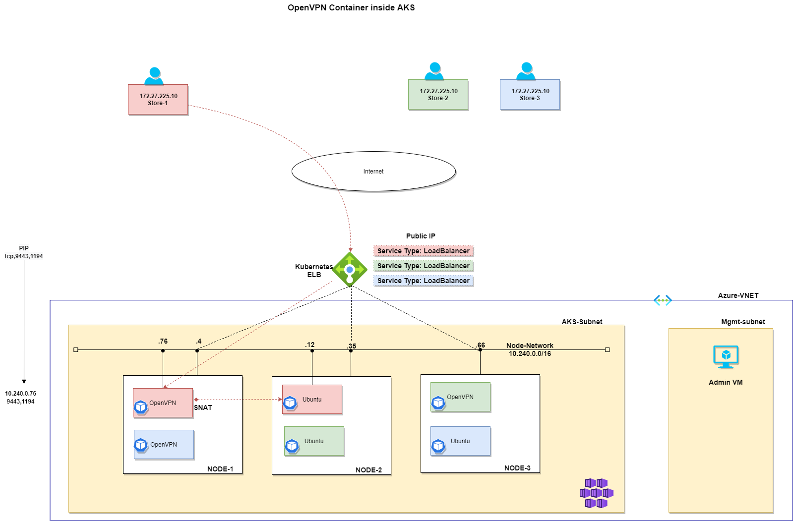

# Purpose

This documentation is a reference architecture for a multi-tenant application where an instance of OpenVPN in each Kubernetes namespace is needed to connect to each facility's store.

# Architecture diagram

## Using Docker Host

This diagram shows running OpenVPN inside a Docker container using a single VM inside Azure with a Public IP. 

## Kubernetes Deployment

This diagram shows running OpenVPN instance per Kubernetes namespace on an AKS cluster. 

## Design Requirements

A multi-tenant Kubernetes cluster with OpenVPN container deployed per namespace with remote access to corresponding on-premises stores.  Each namespace must be isolated from others.

## Prerequisites

1. Familiarity with Docker and Kubernetes networking
2. Linux VM in Azure with Public IP as a Docker Host
3. AKS Cluster in Azure with Calico Network Policy
4. Docker Desktop Running Docker + Kubernetes and WSL(This is optional if you are using #3 and #4. This option can be use for quick testing)

## Project tasks breakdown

Note: Steps 1-6 involves manual steps to prove out end-to-end network connectivity for this POC design. Starting task#6 we will introduce automation.

1. [Run Openvpn Access Server(openvpn-as) container on a docker host](docker/README.md)
2. [Configure and test end-to-end connectivity with Openvpn Client](openvpn/setup.md)
3. [Build docker-compose.yaml file](docker/README.md)
4. [Generate k8s manifest files using kompose](aks/README.md)
5. [Run the container in AKS](aks/README.md)
6. [Test outbound access from AKS pod -> OpenVPN Client for connections initiated from AKS side](aks/README.md)
7. Configure AKS pod as an OpenVPN client
8. Build a secure custom image for OpenVPN server (not Access Server)
9. Build automation and devops practice
10. Secure management access
11. Kubernetes namespace security with Azure Policy
12. AKS pod as a OpenVPN client

## Contributors

Thank you [Tommy Falgout](https://github.com/lastcoolnameleft) for the contributions

## Acknowledgments
