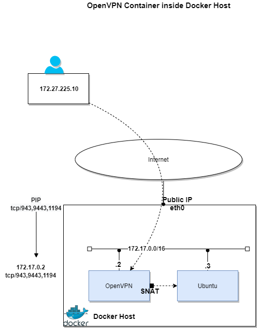

# Architecture diagrams

# OpenVPN Container Image

https://hub.docker.com/r/linuxserver/openvpn-as

# Docker Desktop with WSL Linux

#### Create a new OpenVPN Container using Docker CLI

      docker ps -a
      docker rm -f openvpn-as
      docker run -d --name=openvpn-as --cap-add=NET_ADMIN -e PUID=1000 -e PGID=1000 -e TZ=Europe/London -e INTERFACE=eth0 `#optional` -p 943:943 -p 9443:9443 -p 1194:1194/udp -v $PWD/data:/config --restart unless-stopped ghcr.io/linuxserver/openvpn-as
      docker logs openvpn-as --follow
      docker ps
      docker exec -it openvpn-as sh

#### Validate IP Address, Volume and test admin access to the OpenVPN container

      docker inspect openvpn-as
      docker inspect openvpn-as | grep -w "Mounts" -A 10
      docker inspect openvpn-as | grep -w "Networks" -A 10
      https://localhost:943/admin/

#### Create an ubuntu container and test connectivity to OpenVPN container

      docker run -dit --name ubuntu ubuntu
      docker inspect ubuntu | grep -w "Networks" -A 10
      docker exec -it ubuntu sh
      ifconfig
      apt-get update
      apt-get install iputils-ping tcpdump iproute2 net-tools curl

# Azure VM with Public IP as Docker Host

These steps are done on a linux VM running as Docker Host in Azure. Create the OpenVPN and ubuntu containers following the same steps as above. Attach a public IP to the Azure VM.

#### Create OpenVPN container

      docker run -d --name=openvpn-as --cap-add=NET_ADMIN -e PUID=1000 -e PGID=1000 -e TZ=Europe/London -e INTERFACE=eth0 `#optional` -p 943:943 -p 9443:9443 -p 1194:1194/udp -v $PWD/data:/config --restart unless-stopped ghcr.io/linuxserver/openvpn-as
      docker logs openvpn-as --follow
      docker ps
      docker exec -it openvpn-as sh
      curl ifconfig.io

#### Create Ubuntu container

      docker run -dit --name ubuntu ubuntu
      docker exec -it ubuntu sh
      ifconfig
      apt-get update
      apt-get install iputils-ping tcpdump iproute2 net-tools curl

#### Connect client VPN (login using user-s)

[Configure and test end-to-end connectivity with Openvpn Client](openvpn/setup.md)

#### Access the OpenVPN Management UI using the public IP

      https://<PIP_OF_AZURE_VM_RUNNING-DOCKER>:943/admin

#### Login to the OpenVPN and ubuntu containers and validate traffic

      docker exec -it openvpn-as sh
      docker exec -it ubuntu sh
      tcpdump -ni eth0 icmp

# Using Docker Compose

      cd docker (make sure docker_compose.yaml exists - example in the repo)
      docker ps
      docker rm -f openvpn-as  (delete container if it exists)
      docker-compose up  --detach
      docker-compose logs --follow
      docker inspect openvpn-as | grep -w "Networks" -A 10
      docker exec -it openvpn-as sh
